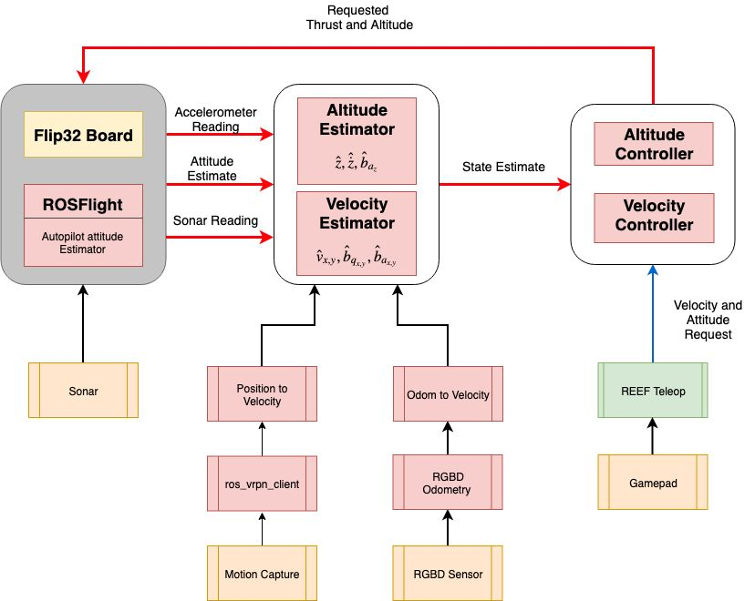

# REEF Estimator Bundle

The REEF Estimator bundle is a collection of repositories that enable a quadrotor to fly holding altitude and take velocity commands from an XBox Controller (or similar controllers) in a indoor environment

It consists the following packages 
- **REEF Estimator** - XY Velocity and Z estimators
- **REEF Msgs** - Support package containing basic functions and ROS message declarations  
- **REEF Teleop** - Converts joy messages to desired commands for REEF control
- **REEF Control** - Simple PID controllers for controlling the altitude and velocity of the vehicle
- **Demo RGBD** - Algorithm to get odometry from RGBD images
- **RGBD_to_velocity** - Converts the output of DEMO RGBD to velocity
- **UNCC RGBD Odom** - RGBD algorithm to convert images to delta-pose estimatoes 
- **Position to Velocity** - Converts position to velocity 
- **Odom to Velocity** - Converts delta-pose to velocity
- **ROS VRPN Client** - Interface between *Optitrack* (ONLY) and ROS. 
- **Astra Launch Driver** - Launch files to get the Orbbec Astra cameras to work
- **Dubins Path** - Path planning algorithm to convert position to velocity requests 

## Wiki
Please read the [WIKI](https://github.com/uf-reef-avl/reef_estimator_bundle/wiki) for build instructions and additional documentation.

## Architecture

The following image gives a high level overview of the design and how every package interacts with one another:


## How do I get started? 
We have tested this bundle on multiple aerial platforms (quads and hexrotors) which had ROSFlight as their Flight Control Unit (FCU). The following instructions apply 
for ROSFlight only. If you do opt for other FCUs the estimator should work but you will have to work on the pipeline. The following steps will walk through the process of getting started from scratch i.e 
building a quadrotor platform to flying using an XBox Controller or flying figure 8 using motion capture.

1) Get a aerial robot or follow the [build instructions](https://github.com/uf-reef-avl/reef_estimator_bundle/wiki) to assemble a quadrotor.
2) Follow the [post build](https://github.com/uf-reef-avl/reef_estimator_bundle/wiki/Post-Build-RC-Configuration) configuration steps to get the quad ready to fly. 
3) Clone and build the REEF_Estimator bundle onto the onboard computer:

    ```html
    mkdir -p catkin_ws/src
    git clone https://github.com/uf-reef-avl/reef_estimator_bundle
    cd reef_estimator_bundle
    git submodule update --init --recursive
    cd .. && catkin build
    ```
    **NOTE**: If you have cloned the ROSFlight repo and the REEF Estimator bundle in estimator_ws/src, the compiler will throw an error when building. Delete the original ROSFlight package you built (not the one inside the bundle. This will save a tonne of time when pull new changes to the REEF Estimator code).
            
3) If you do have motion capture it is very important to perform a camera calibration. This involves both extrisic and intrisic calibration. Please 
take a look at our [camera calibration](https://bitbucket.org/reefavl/camear_calibration_bundle/src) package to do this. There is extensive documentation available in the [camera_mocap_calibration](https://bitbucket.org/reefavl/camera_mocap_calibration) package. 
4) If you do not have motion capture measure the displacement between the IMU and the camera's optical frame along with the rotations. Convert the rotations to quaternions. 
5) Take the output of Step 3 or Step 4 and enter them into the camera_to_body.yaml files in the following packages:
    - [REEF_Estimator](https://github.com/uf-reef-avl/reef_estimator/reef_estimator/src/master/params/dodo_camera.yaml)
    - [Odom_to_Velocity](https://github.com/uf-reef-avl/reef_estimator/odom_to_velocity/src/master/params/camera_to_body.yaml)
    - [Position_to_Velocity](https://github.com/uf-reef-avl/reef_estimator/position_to_velocity/src/master/params/camera_to_body.yaml)
6) After this step, we suggest you read the documentation in each of the packages in the bundle. Even if not EVERY package we highly recommend you go through these packages at least
    - [REEF_Estimator](https://github.com/uf-reef-avl/reef_estimator/reef_estimator)
    - [REEF_Control](https://github.com/uf-reef-avl/reef_estimator/reef_control)
    - [Odom_to_Velocity](https://github.com/uf-reef-avl/reef_estimator/odom_to_velocity)
    - [REEF_Teleop](https://github.com/uf-reef-avl/reef_estimator/reef_teleop)   
7) Once you've read through the documentation, we recommend that you get test the estimator while flying open-loop. The [record_raw.launch](https://bitbucket.org/reefavl/reef_estimator/src/master/launch/record_raw.launch) file will help record a bagfile with topics that is needed by the the estimator to run offline.
    
    **NOTE** This step assumes you have a mocap system. If you do not have one, just use the one's we've provided as a starting point. 
    
    **NOTE** Clone and build the PlotJuggler package. This package will help you plot ROS Topics
    ```html
       mkdir -p reef_estimator_ws/src
       cd estimator_ws/src/
       catkin_init_workspace
       git clone https://github.com/uf-reef-avl/reef_estimator_bundle
       cd estimator_bundle
       git submodule update --init --recursive
       sudo apt install -y libuvc-dev ros-melodic-joy* libsuitesparse-dev libeigen3-dev libsdl1.2-dev
       cd ../.. && catkin build
    ```
 

8) Once you have a tuned estimator, we can move on to the controller. The estimator is capable of taking reading from mocap or the sensors provided and we noticed the PID gains varies depending on the sensor. So, you can tune the gains depending on the sensors you plan on using.
9) We highly recommend that you focus on tuning the Z position and Z velocity controllers first before moving onto the other two axis. Use the dynamic tuning functionality to tune the controllers online
10) Once youre able to get decent params on the Z controllers, move onto the XY velocity controllers.
    **NOTE** You will be using the MIN_THROTTLE setting in the ROSFlight firmware to decide whether it gets commands from the RC or the computer. So, you will have to set the RC throttle to MAX. So it is highly advisable to have two pilots when flying off the controllers. One pilot will have the RC transmitter (safety pilot) the other will command velocities and altitude. You can use the "altitude hold" mode where you can set an initial velocity and then fly off the RC Transmitter
11) Now you should have a tuned estimator and controller that will fly RGBD and sonar measurements.  
12) If you do want to follow setpoints, you can use the dubins_path package which will convert position setpoints to velocity trajectories. Read the documentation for dubins_path to get that setup. It will use the same gains you used to tune the controller. 
        
 ## Vicon vs Optitrack
 
 When developing we used the Optitrack system to generate ground truth. Optitrack due to its popularity in the animation field produces estimates in the (EDN) coordinate frame. Hence the ros_vrpn_client is used to rotate it to the NED frame. If youre using VICON you will not need this since VICON reports estimates in NED frame. You can instead use the [vrpn_client_ros](http://wiki.ros.org/vrpn_client_ros) package.
 
   
## Citation

```asm
@inproceedings{ramos2019reef,
  title={REEF Estimator: A Simplified Open Source Estimator and Controller for Multirotors},
  author={Ramos, J Humberto and Ganesh, Prashant and Warke, William and Volle, Kyle and Brink, Kevin},
  booktitle={2019 IEEE National Aerospace and Electronics Conference (NAECON)},
  pages={606--613},
  year={2019},
  organization={IEEE}
}
``` 

